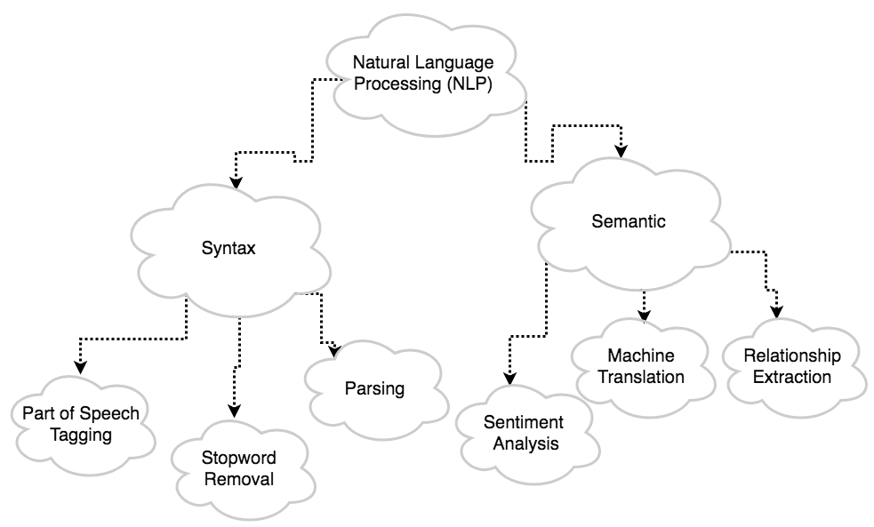

```{r setup, include=FALSE, warning=FALSE}
knitr::opts_chunk$set(echo = TRUE)
library(devtools)
library(Rfacebook)
library(scales)  
library(reshape2) 
library(corrplot)
library(textclean)
library(SnowballC)     # interface to the C libstemmer library that implements Porter's word stemming algorithm for collapsing words to a common root to aid comparison of vocabulary
library(twitteR)
library(tm)     	# text mining
library(syuzhet)     	# extracts sentiment and sentiment-derived plot arcs from text
library(sentimentr)     # sentiment analysis
library(wordcloud)
library(plyr)   
library(ggplot2)
library(readr)
library(ggthemes)
library(highcharter)
library(kableExtra)
load("~/Documents/website/Sentiment-Analysis/Untitled.RData")
```
[_Julio C. Gonzalez_](https://jcgonzalez14.github.io/) 

_May 8, 2018_

!Working Document!
 

Add proposed reading time. 


Hi there, the Stats Whisperer here, back presenting a whole new topic that is a hot commodity these days which is sentiment analysis. Believe it or not but social media can have a powerful impact on a business. Can you imagine a company losing $1.3 billion (not a typo, as in 1,300,000,000 bucks) for a single tweet? Well that was what reportely happened to Snapchat Inc. when Kylie Jenner tweeted about snapchat alegedly dropping their stock value by 7.5%. 

The amount of data genereated by social networks is safe to say enourmous. What if we could use that same data to find insightful information on consumer perspective on just about anything. Well that's exactly what we are going to do. 

<br>

#NLP for Movie Reviews

Ever had a heated disscution with your friends about a particular movie or actor? While you have a strong distaste for anything Nicolas Cage, your "amigo" is in a infatuated trance with all of his movies. So what do you do when the next National Treseaure movie comes out? Naturally, you go, faute-de-mieux, online to investigate what the reviews are for the movie. Well, I won't get into the particulars as to why of those movie reviews are flawed (actually [here](https://fivethirtyeight.com/features/ghostbusters-is-a-perfect-example-of-how-internet-ratings-are-broken/){target="_blank"} is a very detailed article expanding on this issue from my favorite statisically inclined website FiveThirtyEight) but one salient issue is that these reviews are one dimensional. All they do is give a score from 1 to 10 or 1 to 5 stars for a particular movie but they don't tell you _why_ they are given this score. Sure, some people add a their opinion on the movie but who has time to read all of them? Furthermore, these movie rating sites are highly correlated with each and here we have some [data](https://github.com/fivethirtyeight/data/tree/master/fandango){target="_blank"} to confirm that. 

```{r, warning=FALSE, message=FALSE}
fandango <- read_csv("~/Documents/website/Sentiment-Analysis/fandango_score_comparison.csv")
t1 = fandango[,c(2:5)]
#corrplot(cor(t1), method="circle")
hchart(cor(t1)) %>% hc_add_theme(hc_theme_darkunica())
```

In the above diagram, we did a simple correlation plot between the movie ratings given by the major movie review sites and found all of them to be highly correlated with each other. For those non-stats heads out there, a correlation plot deploys a simple staticical algorithm known as the Pearson correlation value that finds how correlated two variables are to each other. There are several ways this formula can be written but here is one that I think makes the more intuitive sense. $$r = \frac{\sum_{i = 1}^{n}(x_i - \bar{x})(y_i - \bar{y})}{\sqrt{\sum_{i = 1}^{n}(x_i - \bar{x})^2}\sqrt{\sum_{i = 1}^{n}(y_i - \bar{y})^2}}$$ The scale falls between -1 and 1 (inclusive) where a value of -1 means that the direc

I propose a solution: why don't we use the massive amount of user generated data of social networks to try and understand what are the reasons a user _feels_ a certain way towards a movie. Instead of using the small sample size of the users on movie review sites, let's include a larger, more diverse and a more representive sample of what the average paying customer that drives films success. In addition, we might be able to extract what elements of movies makes it more likely for a good review. I don't mean to get all Freudian but it could give us a window into the subconcious feelings towards a particular movie.

In order to do that we would be using natural language processing. The following diagram gives a rough explaination as to what encompases NLP and how it is divided. There are other areas where NLP has application significance but for the most part it falls under these two categories.



Our focus will be the utilization of sentiment analysis but we will also use NLP to clean up the syntax of the data using stopword removal.


Paradoxially, in order for someone to give a horror movie a high rating is by being scared out of your socks. 


<br>

##Deadpool

I will confess that I am a big superhero fan and will watch anything superhero related. 


In order to conduct this analysis the most important thing we will need wil be the data. The great thing about Twitter is that it has an API (application programming interface) where instead of writing a script that will scrap the tweets from the webpage, we have direct access to the database where all the data on the tweets live. On top of that, there is an R package that has all the code wrapped up in a function that will do all of the leg work for you. All you have to do is pass the parameters for what you want to search for. Let's see how it works. 

```{r, eval=FALSE}
## Pulling Twitter Data 
deadpool1 <- searchTwitter("Deadpool", n=34000, lang="en", since = "2018-05-16", until = "2018-05-17")     # Pull Twitter feed for Deadpool.
deadpool1<- twListToDF(deadpool1)     # Convert into a data frame for analysis.
``` 

In the above code, we pulled 34,000 tweets containing the word "Deadpool" right up until the day before the premiere (movie debuted on May 18, 2018 in the US). Our goal is to analyze the sentiment before the movie was released to use it as a reference point and compare it to the sentiment after the movie premiered to see if we can find something there. 

```{r,include=FALSE, warning=FALSE}
load("/Users/juliogonzalez/Documents/website/Sentiment-Analysis/Deadpool_05162018.RData")
load("/Users/juliogonzalez/Documents/website/Sentiment-Analysis/Deadpool_05172018.RData")
deadpool1 = rbind(DP_051618,DP_051718)
``` 


Let's take a closer look at the data.
```{r, warning=FALSE}
head(deadpool1)
``` 

Here we see a snippet of the first 6 rows of the data. It starts off with text of the tweet followed by all sorts of information like when it was created, the device used to tweet, the screen name of the user, etc. We are primarily interested in the text of the tweet itself but this is just to show you that there is potential to conduct an even further analysis using Twitter data.

```{r}
summary(deadpool1)
``` 
Here is also some summary statistcs.

By giving the data a quick glance, we see that our data captures a particular tweet that went viral leading up to the movie premiere.


<br>

#Regular Expression

Every now and then, I like to include special topics (like regular expression) that don't strictly fall under the subject at hand (NLP in this case) per se, but has some value when used in conjunction. 

Going back to our data. First, we will create a vector that conains all of the text from the tweets. 

We will see that the tweets are "dirty" meaning that they contain unusefull information that is not needed to do sentiment analysis. In order to clean them up, we will use something called [regular expressions](https://en.wikipedia.org/wiki/Regular_expression){target="_blank"}. You can think of regular expression as a very powerful string search language that can be used to replace individual letters or entire sections of text.

For example, this the text for the viral aforementioned tweet.
```{r}
twtxt <- deadpool1$text     # Collect text for sentiment analysis.
twtxt[2] 
``` 

We can see it contains a link, a screen name and special characters which are of no use to us. However in order to remove them, we must first identify them using regular expressions. 

```{r}
twtxt <- gsub("http://t.co/[a-z,A-Z,0-9]*{8}" , "", twtxt)     	# Clean up Tweets. Remove certain characters.
twtxt <- gsub("https://t.co/[a-z,A-Z,0-9]*{8}", "", twtxt)
twtxt <- gsub("RT", "", twtxt) # Removes "RT" indicating a retweet
twtxt <- gsub("@.*:", "", twtxt) # Removes screen names from retweets
``` 

```{r}
twtxt[2] #print clean text
``` 

After we removed all the unuseful stuff, we now see clean text that we can use to extract the sentiment of the tweet. 

<br>

#Syntax NLP

As we get closer to sentiment analysis, let's take a step back. Even though our tweets are "clean", they still contain irrelevant information. In order to get the core of sentiment we must first remove stopwords. Stopwords are simply commonly used words that do not contribute to the significance of the overall text. Examples include: the, to, and, that, etc. In addition, we remove numbers and punctuation as well. The following code does this:

```{r}
Encoding(twtxt) <- "latin1"     				
twtxt <- iconv(twtxt, from="latin1", to="ASCII", sub="")     	# Convert to ASCII format.

mycorpus <- Corpus(VectorSource(twtxt))     			# Create corpus.
mycorpus <- tm_map(mycorpus, content_transformer(tolower))	# Create corpus of text while making all characters lowercase.
mycorpus <- tm_map(mycorpus, stripWhitespace)			# Remove white space.
mycorpus <- tm_map(mycorpus, removePunctuation)			# Remove punctuation.
mycorpus <- tm_map(mycorpus, removeNumbers)			# Remove numbers.
mycorpus <- tm_map(mycorpus, removeWords, stopwords())	# Remove stop words
mycorpus <- tm_map(mycorpus, removeWords, c("deadpool")) # Remove other words.
mycorpus[[2]]$content     # View the content of tweet.
``` 
Now we can see how the original tweet has been reduced to a few simple strings. With this data at hand, we can create a word cloud. 

```{r, echo=FALSE}
# Create word cloud to look for trends.
wordcloud(mycorpus, scale=c(5, 0.5), max.words=150,random.order=F, rot.per=0.35, use.r.layout=F, colors=brewer.pal(8, "Dark2"))
``` 

As expected, we see the word cloud is dominated by the words found in the viral tweet. 

<br>

#Semantic NLP

Now we get to the meat and potatoes of NLP and apply sentiment analysis to the our text corpus to try to find some useful insight into these tweets. Before we do that, let's look into what sentiment analysis is and what it actually does. There are many types of sentiment analyses so we'll start with a simple one, polarity score. What this does it compares the words in each tweet and compares it to a dictionary of polarized words. A positive score indicates a positive sentiment while the converse will imply the same thing. The score will depend on the dictionary that you are using. This function defaults to a combined and augmented version of Jocker's (2017) [originally exported by the syuzhet package] & Rinker's augmented Hu & Liu (2004) dictionaries in the lexicon package, however, this may not be appropriate, for example, in the context of children in a classroom. The user may (is encouraged) to provide/augment the dictionary (see the as_key function). For instance the word "sick" in a high school setting may mean that something is good, whereas "sick" used by a typical adult indicates something is not right or negative connotation (deixis). 

```{r, warning=FALSE}
# Perform the sentiment analysis on Tweets.
final <- data.frame(text=sapply(mycorpus, identity), stringsAsFactors=F)
#sent_combo <- sentiment(final$text)     # Pull sentiment.
head(sent_combo)
``` 

Here every row represents the output of the sentiment analysis for all of the 34,000 tweets where the "sentiment" column displays the score given to that particular tweet. 

```{r}
mean(sent_combo$sentiment)     # average sentiment
``` 

Finally, we find that average sentiment falls at 0.0562 which is just slightly positive. 

Here we see it visually.
```{r, echo=FALSE}
# Sentiment per Tweet
aggtwitter <- aggregate(round(sent_combo$sentiment,3), by=list(sent_combo$element_id), FUN=mean)

#line graph (couldn't use highcharts)
ggplot(data=aggtwitter,aes(x=Group.1, y=x))+geom_bar(stat="identity", fill="#EA1313") +
ggtitle("Sentiment per Tweet") + labs(x="Tweet", y="Sentiment Score") + theme_dark()
``` 

Here we see the sentiment score ploted across all of our tweets. We observe a few crazy scores here and there but for the most part we see that most tweets are neutral. Feel free to zoom in the histogram by selecting across several columns.

```{r, echo=FALSE}
hchart(aggtwitter$x, type = 'histogram', name = "Cumulative Sentiments",
       color = "#B71C1C", breaks = 27, edgeColor = "#9D1313", edgeWidth = 2,
       showInLegend = FALSE
       ) %>% 
  hc_xAxis(title = list(
             text = "Sentiment Score"
           )) %>% 
  hc_yAxis(title =list(text = "Count of Sentiment Scores")) %>%
  hc_add_theme(hc_theme_darkunica()) %>%
  hc_chart(options3d = list(enabled = TRUE, alpha = 13)) %>%
  hc_tooltip(formatter = JS("function(){
                          return ('Total: ' + this.y + ' <br> Sentiment Range: ' + Math.round((this.point.x - 0.05)*100) / 100 + ' to ' + Math.round((this.point.x + 0.05)*100) / 100)
                          }"))
``` 

As explained previously, you will get different results based on the sentiment dictionary you are using. Here, we will be using syuzhet dictionary.

```{r}
#sent_syuzhet <- get_sentiment(final$text, method="syuzhet")     # method="bing", "afinn", "nrc", "stanford" 
mean(sent_syuzhet)     # average sentiment
``` 

Using the syuzhet dictionary, we now get an average sentiment score of about 0.2 which is not that much terribly more than when we used previously. 


```{r,echo=FALSE}
df = data.frame(sent_syuzhet)

hchart(df$sent_syuzhet, type = 'histogram', name = "Cumulative Sentiments",
       color = "#B71C1C", breaks = 27, edgeColor = "#9D1313", edgeWidth = 2,
       showInLegend = FALSE
       ) %>%
  hc_xAxis(title = list(
             text = "Sentiment Score"
           )) %>% 
  hc_yAxis(title =list(text = "Count of Sentiment Scores")) %>%
  hc_add_theme(hc_theme_darkunica()) %>%
  hc_chart(options3d = list(enabled = TRUE, alpha = 13)) %>%
  hc_tooltip(formatter = JS("function(){
                          return ('Total: ' + this.y + ' <br> Sentiment Range: ' + Math.round((this.point.x - 0.05)*100) / 100 + ' to ' + Math.round((this.point.x + 0.05)*100) / 100)
                          }")
  )%>%
  hc_title(text = "Sentiment Analysis using Syuzhet Dictionary")

``` 


Generally, it is expected that the ratio between positive and negative will be correlated with the movie review which is great but not very insightful. We can actually go at a much deeper level by acquiring a sentiment score of more particular kind of emotions. We can achieve that by using the NCR dictionary where each tweet results in a score to 8 additional categories that now include sentiments like: anger, anticipation, disgust, fear, joy, sadness and trust. 

```{r, echo=FALSE}
#sent_nrc <- get_nrc_sentiment(final$text)     # Get more detailed sentiment.
head(sent_nrc)
``` 


```{r, echo=FALSE}
sentsum <- colSums(sent_nrc)
df_nrc = data.frame(sentsum)
df_nrc$sentiments = rownames(df_nrc)

#changing options to replace space with comma
hcoptslang <- getOption("highcharter.lang")
hcoptslang$thousandsSep <- ","
options(highcharter.lang = hcoptslang)

#plots all the sentiments
highchart() %>% 
  hc_add_series(data = df_nrc, type = "column", showInLegend = FALSE, name = "Total Value", hcaes(x = sentiments, y = sentsum, color = sentiments)) %>%
  hc_xAxis(categories = df_nrc$sentiments,
           title = list(
             text = "Sentiments"
           )
  ) %>%
  hc_yAxis(title =list(text = "Sum of Sentiments")) %>%
  hc_add_theme(hc_theme_darkunica()) %>%
  hc_chart(options3d = list(enabled = TRUE, beta = 20))

``` 


###############################################################################################


#Part 2


Having inspected the sentiment prior to Deadpool 2's premier, now we would like to see the sentiment as more and more people see the movie. 

First we will pull tweets on the day it premiered and the day after. 

```{r, eval=FALSE}
## Pulling Twitter Data 
deadpool2 <- searchTwitter("Deadpool", n=34000, lang="en", since = "2018-05-18", until = "2018-05-19")     # Pull Twitter feed for Deadpool after premiere
deadpool2<- twListToDF(deadpool2)     # Convert into a data frame for analysis.
```

```{r,include=FALSE, warning=FALSE}
load("/Users/juliogonzalez/Documents/website/Sentiment-Analysis/DP_051818.RData")
load("/Users/juliogonzalez/Documents/website/Sentiment-Analysis/DP_051918.RData")
deadpool2 = rbind(DP_051818,DP_051918)
``` 


```{r, warning=FALSE}
twtxt2 <- deadpool2$text 
twtxt2 <- gsub("http://t.co/[a-z,A-Z,0-9]*{8}" , "", twtxt2)     	# Clean up Tweets. Remove certain characters.
twtxt2 <- gsub("https://t.co/[a-z,A-Z,0-9]*{8}", "", twtxt2)
twtxt2 <- gsub("RT", "", twtxt2) # Removes "RT" indicating a retweet
twtxt2 <- gsub("@.*:", "", twtxt2) # Removes screen names from retweets

Encoding(twtxt2) <- "latin1"     				
twtxt2 <- iconv(twtxt2, from="latin1", to="ASCII", sub="")     	# Convert to ASCII format.

mycorpus2 <- Corpus(VectorSource(twtxt2))     		# Create corpus.
mycorpus2 <- tm_map(mycorpus2, content_transformer(tolower))	# Create corpus of text.
mycorpus2 <- tm_map(mycorpus2, stripWhitespace)		# Remove white space.
mycorpus2 <- tm_map(mycorpus2, removePunctuation)		# Remove punctuation.
mycorpus2 <- tm_map(mycorpus2, removeNumbers)			# Remove numbers.
mycorpus2 <- tm_map(mycorpus2, removeWords, stopwords())	# Remove stop words. 
mycorpus2 <- tm_map(mycorpus2, removeWords, c("deadpool")) # Remove other words.
``` 

```{r, echo=FALSE}
# Create word cloud to look for trends.
wordcloud(mycorpus2, scale=c(5, 0.5), max.words=100, random.order=F, rot.per=0.35, use.r.layout=F, colors=brewer.pal(8, "Dark2"))
``` 

```{r,echo=FALSE}
# Perform the sentiment analysis on Tweets.
final2 <- data.frame(text=sapply(mycorpus2, identity), stringsAsFactors=F)
#sent_combo2 <- sentiment(final2$text)    # Pull sentiment.
``` 

```{r}
mean(sent_combo2$sentiment)    # average sentiment
``` 
We can see the sentiment has actually gone up. 


```{r, echo=FALSE}
# Sentiment per Tweet
aggtwitter2 <- aggregate(sent_combo2$sentiment, by=list(sent_combo2$element_id), FUN=mean)

#line graph
ggplot(data=aggtwitter2, aes(x=Group.1, y=x)) + geom_bar(stat="identity", fill = "#EA1313") +
ggtitle("Sentiment per Tweet") + labs(x="Tweet", y="Sentiment Score") + theme_dark()
``` 

```{r, echo=FALSE}
hchart(aggtwitter2$x, type = 'histogram', name = "Cumulative Sentiments",
       color = "#B71C1C", breaks = 27, edgeColor = "#9D1313", edgeWidth = 2,
       showInLegend = FALSE
       ) %>% 
  hc_xAxis(title = list(
             text = "Sentiment Score"
           )) %>% 
  hc_yAxis(title =list(text = "Count of Sentiment Scores")) %>%
  hc_add_theme(hc_theme_darkunica()) %>%
  hc_chart(options3d = list(enabled = TRUE, alpha = 13)) %>%
  hc_tooltip(formatter = JS("function(){
                          return ('Total: ' + this.y + ' <br> Sentiment Range: ' + Math.round((this.point.x - 0.05)*100) / 100 + ' to ' + Math.round((this.point.x + 0.05)*100) / 100)
                          }"))
``` 


```{r}
#sent_syuzhet2 <- get_sentiment(final2$text, method="syuzhet")     # method="bing", "afinn", "nrc", "stanford" 
mean(sent_syuzhet2)     # average sentiment
``` 

```{r,echo=FALSE}
df2 = data.frame(sent_syuzhet2)

hchart(df2$sent_syuzhet2, type = 'histogram', name = "Cumulative Sentiments",
       color = "#B71C1C", breaks = 27, edgeColor = "#9D1313", edgeWidth = 2,
       showInLegend = FALSE
       ) %>%
  hc_xAxis(title = list(
             text = "Sentiment Score"
           )) %>% 
  hc_yAxis(title =list(text = "Count of Sentiment Scores")) %>%
  hc_add_theme(hc_theme_darkunica()) %>%
  hc_chart(options3d = list(enabled = TRUE, alpha = 13)) %>%
  hc_tooltip(formatter = JS("function(){
                          return ('Total: ' + this.y + ' <br> Sentiment Range: ' + Math.round((this.point.x - 0.05)*100) / 100 + ' to ' + Math.round((this.point.x + 0.05)*100) / 100)
                          }")
  )%>%
  hc_title(text = "Sentiment Analysis using Syuzhet Dictionary")
```

```{r}
#sent_nrc2 <- get_nrc_sentiment(final2$text)     # Get more detailed sentiment.
``` 

```{r,echo=FALSE}
sentsum2 <- colSums(sent_nrc2)
df_nrc2 = data.frame(sentsum2)
df_nrc2$sentiments = rownames(df_nrc2)

#plots all the sentiments
highchart() %>% 
  hc_add_series(data = df_nrc2, type = "column", showInLegend = FALSE, name = "Total Value", hcaes(x = sentiments, y = sentsum2, color = sentiments)) %>%
  hc_xAxis(categories = df_nrc2$sentiments,
           title = list(
             text = "Sentiments"
           )
  ) %>%
  hc_yAxis(title =list(text = "Sum of Sentiments")) %>%
  hc_add_theme(hc_theme_darkunica()) %>%
  hc_chart(options3d = list(enabled = TRUE, beta = 20))
``` 

#Comparisons
<style>
.table-hover > tbody > tr:hover { 
  background-color: #f4f442;
}
</style>
```{r, echo=FALSE}
  
tbl = data.frame(
  dictionary_used = c("combo","syuzhet","bing","afinn","nrc"),
  prior_sent = c(mean(sent_combo$sentiment),mean(sent_syuzhet),mean(sent_bing),mean(sent_afinn),mean(sent_nrC)),
  after_sent = c(mean(sent_combo2$sentiment),mean(sent_syuzhet2),mean(sent_bing2),mean(sent_afinn2),mean(sent_nrC2))
)

tbl$difference =  tbl$after_sent - tbl$prior_sent
tbl$percent_change = paste0(round((tbl$diff / tbl$prior_sent)*100,2), "%")
colnames(tbl) = c("Dictionary Used", "Sentiment Before Movie Premier","Sentiment After Movie Premier","Difference","Percent Change")

kable(tbl) %>% kable_styling(bootstrap_options = c("striped", "hover","responsive", "bordered"), font_size = 20) %>%
  #add_header_above(c(" ", "Polarity Score" = 2, " " = 2)) %>%
  footnote(general = "Combo dictionary is using a combination of the two dictionaries")

``` 

<br>


#Conclusion

Using NLP with social media data is a different type of approach to movie reviews and one in which one can argue provides a closer and more organic assessment of public perception towards a particular film.

Since social networks are perpetually genereting data, they provide a more real time information stream of the consumer's preferences akin to how a company's stock value is a measure of its performance. Instead of the traditional approach where one sees a movie then writes a review one time, we have a constant feed  

Thinking on a much larger scale, we can expand this to include multiple social networks that include even more niche users like Reddit, Quora and even comments on YouTube and do comparisons across networks. Furthermore, since the production of a movie incorborates people who are continously in the public's eye, we can observe the effect of an important event in an actor's life outside of films sort of like how music sales shoot through the roof in the aftermath of an artist's death.

To bring this home, Basically, we have unprecidented access to a multi facet view towards the film industry. In truth, while we now have more data avaialble, extracting the signal rather than the noise from this data is, even today, an incrediably difficult task. If you pile privacy concerns on top of that, it can really get messy. Sure movie production companies with deep pockets can use this infomation for to improve their bottom line, but the question is _should_ they have access to this type of intimate information. Who knew that a simple tweet provides so much information about you.

In the words of Peter Parker in rememberance to his uncle Ben at the end of the spider-man movie,

> ["With great power comes, great responsibility."](https://www.youtube.com/watch?v=kb4jEHmH_kU){target="_blank"}


Thanks for reading.


