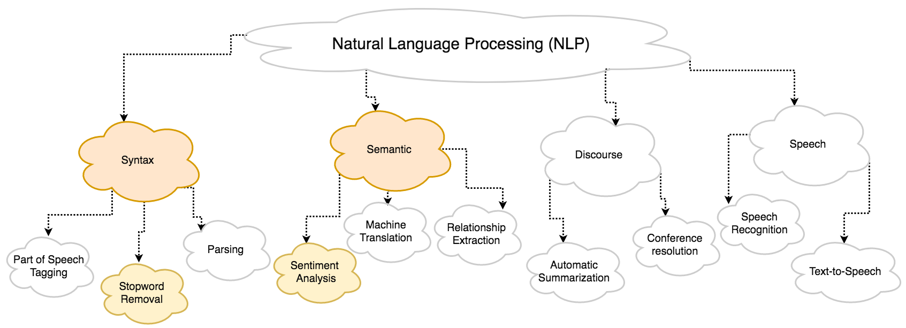

```{r setup, include=FALSE, warning=FALSE}
knitr::opts_chunk$set(echo = TRUE)
library(devtools)
library(Rfacebook)
library(scales)  
library(reshape2) 
library(corrplot)
library(textclean)
library(SnowballC)     # interface to the C libstemmer library that implements Porter's word stemming algorithm for collapsing words to a common root to aid comparison of vocabulary
library(twitteR)
library(tm)     	# text mining
library(syuzhet)     	# extracts sentiment and sentiment-derived plot arcs from text
library(sentimentr)     # sentiment analysis
library(wordcloud)
library(plyr)   
library(ggplot2)
library(readr)
library(ggthemes)
library(highcharter)
library(kableExtra)
load("~/Documents/website/Sentiment-Analysis/Untitled.RData")
```
[Julio C. Gonzalez](https://jcgonzalez14.github.io/) 

_June 21, 2018_  

Estimated Reading time: ~18 mins  

<br>

#Introduction

Hi there, the Stats Whisperer here, back presenting a hot topic these days in the tech community and a very active area of research which is natural-language processing (NLP for short). But first, what is natural-language processing? According to Wikipedia, it is "[an area of computer science and artificial intelligence concerned with the interactions between computers and human languages](https://en.wikipedia.org/wiki/Natural-language_processing){target="_blank"}." In the age of the pervasive virtual assistant like Apple's Siri and Amazon's Alexa, NLP is the engine that drives this ubiquitous technology. 

The field of NLP is deep and extensive so let's take a look at it from a high level. The following diagram gives a rough explanation as to what encompasses NLP and how it is loosely divided. 



As you can see, there are many applications of NLP but we will narrow our focus today to the first two categories; syntax and semantic. Don't worry. I'll be explaining what those are along the way. But first I want to ask you a simple question: what movies do you like to see and why?

<br>

#NLP for Movie Reviews

Ever had a heated discussion with your friends about a particular movie or actor? While you have a strong distaste for anything Nicolas Cage, your "amigo" is in a infatuated trance with all of his movies. So what do you do when the next National Treasure movie comes out? Naturally, you go, faute-de-mieux, online to investigate what the reviews are for the movie. Well, I won't get into the particulars as to why those movie reviews are flawed (actually [here](https://fivethirtyeight.com/features/ghostbusters-is-a-perfect-example-of-how-internet-ratings-are-broken/){target="_blank"} is a very detailed article expanding on this issue from my favorite statistically inclined website, FiveThirtyEight.com) but one salient issue is that these reviews are one dimensional. All they do is give a score from 1 to 10 or 1 to 5 stars for a particular movie but they don't tell you _why_ they are given this score. Sure, some people add their comments on the movie but does that mean that people from all over the world will have the same impression or opinion? I would argue that they don't. Plus, who has time to read all those reviews anyways? Furthermore, these movie rating sites are highly correlated with each and here we have some [data](https://github.com/fivethirtyeight/data/tree/master/fandango){target="_blank"} to confirm that. 

```{r, warning=FALSE, message=FALSE, eval=FALSE, include=FALSE}
fandango <- read_csv("~/Documents/website/Sentiment-Analysis/fandango_score_comparison.csv")
t1 = fandango[,c(2:6)]
hchart(cor(t1))
``` 

```{r,echo=FALSE}
#corrplot(cor(t1), method="circle")
hchart(cor(t1)) %>% hc_add_theme(hc_theme_darkunica()) %>%
  hc_tooltip(style = list(fontSize = "17px")) %>%
  hc_xAxis(title = list(
             style = list(
               color = "white"
             )
           ),
           labels = list(
             style = list(
               fontSize = "15px"))
  ) %>%
  hc_yAxis(title =list(style = list(
                         color = "white"
                       )),
           labels = list(
             style = list(
               fontSize = "16px")
           ))
```

Using the data we acquired from FiveThirtyEight.com, we did a simple correlation plot between the movie ratings given by the major movie review sites and found all of them to be highly correlated with each other. For those non-stats heads out there, a correlation plot deploys a simple statistical algorithm known as the Pearson correlation value that finds how correlated two variables are to each other. There are several ways this formula can be written but here is one that I think makes the more intuitive sense. $$r = \frac{\sum_{i = 1}^{n}(x_i - \bar{x})(y_i - \bar{y})}{\sqrt{\sum_{i = 1}^{n}(x_i - \bar{x})^2}\sqrt{\sum_{i = 1}^{n}(y_i - \bar{y})^2}}$$ The scale falls between -1 and 1 (inclusive) where a value of 1 means that the direction of the relationship between two variables is a perfect positive relationship meaning, that as the score of one website goes up, the score of the oposing website goes up by the exact proportional amount.

We observe that all scores are above 0.6, indicating a positive correlation between all the major movie review websites. What this is saying is that whatever score you see on one website then you pretty much have an idea what the score is on the other websites. The main point is that there is no variety in terms of scoring while in real life we see people disagree about movies all the time.  

I propose a solution: why don't we use the massive amount of user generated data of social networks to try and understand what are the reasons a user _feels_ a certain way towards a movie. Instead of using the small sample size of the users on movie review sites, let's include a larger, more diverse and a more representative sample of what the average paying customer that drives movie success. In addition, we might be able to extract what elements of movies makes it more likely for a good review. I don't mean to get all Freudian but it could give us a window into the subconscious feelings towards a particular movie. NLP has something called sentiment analysis which allows a machine to extract the feelings of text (crazy, I know). If we could use sentiment analysis on social media data then "winner winner chicken dinner."

If you aren't really buying the credibility or impact social media can have on a business then let's look at what happened to Snapchat Inc.

Can you imagine a company losing $1.3 billion (not a typo, as in 1,300,000,000 bucks) for a single tweet? Well that was what reportedly happened to Snapchat Inc. when [Kylie Jenner negatively tweeted about Snapchat allegedly dropping their stock value by 6.1%](https://www.bloomberg.com/news/articles/2018-02-22/snap-royalty-kylie-jenner-erased-a-billion-dollars-in-one-tweet){target="_blank"}. If that won't make heads turn, then nothing will. 


<br>

##Deadpool 2

To see the power of NLP in action, we are going to acquire data about a recent movie. For no particular reason other than the fact that I loved the first Deadpool movie and am a huge Marvel movie fan even though my all-time favorite superhero is Batman (Justice League was hard pill to swallow), we are going to use [Deadpool 2](https://en.wikipedia.org/wiki/Deadpool_2) for this example. 

In order to conduct this analysis, the most important thing we will need will be the data. The great thing about Twitter is the existence of an API ([application programming interface](https://medium.freecodecamp.org/what-is-an-api-in-english-please-b880a3214a82){target="_blank"}) where instead of writing a script that will scrap the tweets from a webpage, we have direct access to the database where all the data on the tweets lives. On top of that, there is an R package that has all the code wrapped up in a function that will do all of the leg work for you. All you have to do is pass the parameters for what you want to search for and you're off to the races. Let's see how it works. 

```{r, eval=FALSE}
## Pulling Twitter Data 
DP_051618 <- searchTwitter("Deadpool", n=17000, lang="en",
                           since = "2018-05-16", until = "2018-05-16")     # Pull Twitter feed for Deadpool.
DP_051618<- twListToDF(DP_051618)     # Convert into a data frame for analysis.

DP_051718 <- searchTwitter("Deadpool", n=17000, lang="en",
                           since = "2018-05-17", until = "2018-05-17")     # Pull Twitter feed for Deadpool.
DP_051718<- twListToDF(DP_051718)     # Convert into a data frame for analysis.
``` 

In the above code, we pulled 17,000 tweets for each of the two days leading up to the premiere (movie debuted on May 18, 2018 in the US). Our goal is to analyze the sentiment before the movie was released to use it as a reference point and compare it to the sentiment after the movie premiered to see if we can find something insightful. We are only pulling 17,000 tweets for each day because the twitter API imposes a limit to prevent you from downloading their entire database and replicating their website. If you are unsatisfied with this limitation, you can actually get a [premium API](https://developer.twitter.com/en/products/products-overview){target="_blank"} or you can also consider using [streaming data](https://developer.twitter.com/en/docs/tutorials/consuming-streaming-data.html){target="_blank"}. It gets a little more complicated because of the technicality to implement but it is an option for scalable projects.


Going back to our data, here is where we combine the data for the two days we pulled into a single data frame.
```{r, eval=FALSE}
deadpool1 = rbind(DP_051618,DP_051718)
```

Before we go any further, let's take a closer look at the data.
```{r, warning=FALSE}
head(deadpool1)
``` 

Here we see a snippet of the first 6 rows of the data. It starts off with text of the tweet followed by all sorts of information like when it was created, the device used to tweet, the screen name of the user, etc. We are primarily interested in the text of the tweet itself but this is just to show you that there is potential to conduct an even deeper analysis using Twitter data.

```{r}
summary(deadpool1)
``` 
Here are some summary statistics.

By giving the data a quick glance, we see that our data captures a particular tweet that went viral leading up to the movie premiere.


<br>

#Regular Expression

Every now and then, I like to include special topics (like regular expression) that don't strictly fall under the subject at hand per se, but has some value when used conjointly. 

Going back to our data. First, we will create a vector that contains all of the text from the tweets. 

We will see that the tweets are "dirty" meaning that they contain useless information that is not needed to do sentiment analysis. In order to clean them up, we will use something called [regular expressions](https://en.wikipedia.org/wiki/Regular_expression){target="_blank"}. You can think of regular expression as a very powerful string search language that can be used to replace individual letters or entire sections of text.

For example, this the text for the viral aforementioned tweet.
```{r}
twtxt <- deadpool1$text     # Collect text for sentiment analysis.
twtxt[2] 
``` 

We can see it contains a link, a screen name and special characters which are of no use to us. Before we are able to remove them, we must first identify them using regular expressions. 

```{r}
twtxt <- gsub("http://t.co/[a-z,A-Z,0-9]*{8}" , "", twtxt)     	# Clean up Tweets. Remove certain characters.
twtxt <- gsub("https://t.co/[a-z,A-Z,0-9]*{8}", "", twtxt)
twtxt <- gsub("RT", "", twtxt) # Removes "RT" indicating a retweet
twtxt <- gsub("@.*:", "", twtxt) # Removes screen names from retweets
``` 

```{r}
twtxt[2] #print clean text
``` 

After we removed all the useless fluff, we are left with clean and lean text vector that we can use to extract the sentiment of the tweet. 

<br>

#Syntax NLP

As we get closer to sentiment analysis, let's take a step back. Even though our tweets are "clean", they still contain irrelevant information. In order to get to the core of sentiment we must first remove stopwords. Stopwords are simply commonly used words that do not contribute to the significance of the overall text. Examples include: the, to, and, that, etc. In addition, we remove numbers and punctuation as well. The following code executes this:

```{r,eval=FALSE}
Encoding(twtxt) <- "latin1"     				
twtxt <- iconv(twtxt, from="latin1", to="ASCII", sub="")    # Convert to ASCII format.

mycorpus <- Corpus(VectorSource(twtxt))     			# Create corpus.
mycorpus <- tm_map(mycorpus, content_transformer(tolower))	# Create corpus of text while making all characters lowercase.
mycorpus <- tm_map(mycorpus, stripWhitespace)			# Remove white space.
mycorpus <- tm_map(mycorpus, removePunctuation)			# Remove punctuation.
mycorpus <- tm_map(mycorpus, removeNumbers)			# Remove numbers.
mycorpus <- tm_map(mycorpus, removeWords, stopwords())	# Remove stop words
mycorpus <- tm_map(mycorpus, removeWords, c("deadpool")) # Remove other words.
mycorpus[[2]]$content     # View the content of tweet.
``` 
Now we can see how the original tweet has been reduced to a few simple strings. With this data at hand, we can create a word cloud. 

```{r, echo=FALSE}
# Create word cloud to look for trends.
wordcloud(mycorpus, scale=c(5, 0.5), max.words=150,random.order=F, rot.per=0.35, use.r.layout=F, colors=brewer.pal(8, "Dark2"))
``` 

As expected, we see the word cloud is dominated by the words found in the viral tweet. 

<br>

#Semantic NLP

Now we get to the meat and potatoes of NLP and apply sentiment analysis to the our text corpus. Before we do that, let's look into what sentiment analysis is and what it actually does. There are many types of sentiment analyses so we'll start with a simple one, polarity score. What this does is it grabs the words in each tweet and compares it to a dictionary of polarized words. A positive score indicates a positive sentiment while the converse will imply a negative sentiment. It is important to highlight that the score will depend on the dictionary that you are using. First up, we will be using a combined and augmented version of Jocker's ([2017](https://github.com/trinker/sentimentr){target="_blank"}) & [Rinker's](https://cran.r-project.org/web/packages/lexicon/lexicon.pdf){target="_blank"} augmented Hu & Liu ([2004](https://www.cs.uic.edu/~liub/publications/kdd04-revSummary.pdf){target="_blank"}) dictionaries.

```{r, eval=FALSE}
# Perform the sentiment analysis on Tweets.
final <- data.frame(text=sapply(mycorpus, identity), stringsAsFactors=F)
sent_combo <- sentiment(final$text)     # Pull sentiment.
``` 
Here is a small preview of the results look like.
```{r}
head(sent_combo)
``` 

Every row represents the output of the sentiment analysis for all of the 34,000 tweets where the "sentiment" column displays the score given to that particular tweet. 

Let's see it visually.
```{r, echo=FALSE}
# Sentiment per Tweet
aggtwitter <- aggregate(round(sent_combo$sentiment,3), by=list(sent_combo$element_id), FUN=mean)

#line graph (couldn't use highcharts)
ggplot(data=aggtwitter,aes(x=Group.1, y=x))+geom_bar(stat="identity", fill="#EA1313") +
ggtitle("Sentiment per Tweet") + labs(x="Tweet", y="Sentiment Score") + theme_dark()
``` 

Here we see the sentiment scores plotted across all of our tweets. We observe a few crazy scores here and there but for the most part we see that most tweets are neutral. Feel free to zoom in the following interactive histogram by selecting across several columns.

```{r, echo=FALSE}
hchart(aggtwitter$x, type = 'histogram', name = "Cumulative Sentiments",
       color = "#B71C1C", breaks = 27, edgeColor = "#9D1313", edgeWidth = 2,
       showInLegend = FALSE
       ) %>% 
  hc_xAxis(title = list(
             text = "Sentiment Score",
             style = list(
               color = "white"
             )
           ),
           labels = list(
             style = list(
               fontSize = "16px"
             )
           )) %>% 
  hc_yAxis(title =list(text = "Count of Sentiment Scores",
                       style = list(
                         color = "white"
                       )),
           labels = list(
             style = list(
               fontSize = "16px"
             )
           )
           ) %>%
  hc_add_theme(hc_theme_darkunica()) %>%
  hc_chart(options3d = list(enabled = TRUE, alpha = 13)) %>%
  hc_tooltip(formatter = JS("function(){
                          return ('Total: ' + this.y + ' <br> Sentiment Range: ' + Math.round((this.point.x - 0.05)*100) / 100 + ' to ' + Math.round((this.point.x + 0.05)*100) / 100)
                          }"),
             style = list(
               fontSize = "17px"
             ))%>%
  hc_title(text = "Polarity Scores Histogram")
``` 

```{r}
mean(sent_combo$sentiment)     # average sentiment
``` 

Finally, we find an average sentiment score of 0.0562 which is just slightly positive. 

<br>

As explained previously, you will get different results based on the sentiment dictionary you are using. Let's try using the syuzhet dictionary.

```{r, eval=FALSE}
sent_syuzhet <- get_sentiment(final$text, method="syuzhet")     # method="bing", "afinn", "nrc", "stanford" 
``` 
```{r}
mean(sent_syuzhet)     # average sentiment
``` 

Using the syuzhet dictionary, we now get an average sentiment score of about 0.2 which is not that terribly more than what we got previously. 

Here is this an interactive histogram using the syuzhet dictionary.
```{r,echo=FALSE}
df = data.frame(sent_syuzhet)

hchart(df$sent_syuzhet, type = 'histogram', name = "Cumulative Sentiments",
       color = "#B71C1C", breaks = 29, edgeColor = "#9D1313", edgeWidth = 2,
       showInLegend = FALSE
       ) %>%
  hc_add_theme(hc_theme_darkunica()) %>%
  hc_xAxis(title = list(
             text = "Sentiment Score",
             style = list(
               color = "white")
           ),
           labels = list(
             style = list(
               fontSize = "16px")
           )
  ) %>% 
  hc_yAxis(title =list(text = "Count of Sentiment Scores",
                       style = list(
                         color = "white"
                       )),
           labels = list(
             style = list(
               fontSize = "16px")
           )
  ) %>%
  hc_chart(options3d = list(enabled = TRUE, alpha = 13)) %>%
  hc_tooltip(formatter = JS("function(){
                          return ('Total: ' + this.y + ' <br> Sentiment Range: ' + Math.round((this.point.x - 0.05)*100) / 100 + ' to ' + Math.round((this.point.x + 0.05)*100) / 100)
                          }"),
             style = list(
               fontSize = "17px"
             )
  )%>%
  hc_title(text = "Polarity Scores using Syuzhet Dictionary")

``` 


While finding the polarity score is great, we can actually go at a much deeper level by acquiring a sentiment score of other particular kinds of emotions. We can achieve that by using the NCR dictionary where each tweet results in a score to 8 additional categories that now include sentiments like: anger, anticipation, disgust, fear, joy, sadness and trust. 

```{r, eval=FALSE}
sent_nrc <- get_nrc_sentiment(final$text)     # Get more detailed sentiment.
``` 
```{r}
head(sent_nrc)
``` 
An important highlight of the NRC algorithm is that it provides a score to more than just one column. We can see that observation 5 has a score of 1 for anticipation, fear and joy while simultaneously having a score of 2 for trust. Let's add all of these scores up and visualize it to see what we get.

```{r, echo=FALSE}
sentsum <- colSums(sent_nrc)
df_nrc = data.frame(sentsum)
df_nrc$sentiments = rownames(df_nrc)

#changing options to replace space with comma
hcoptslang <- getOption("highcharter.lang")
hcoptslang$thousandsSep <- ","
options(highcharter.lang = hcoptslang)

#plots all the sentiments
highchart() %>% 
  hc_add_series(data = df_nrc[1:8,], type = "column", showInLegend = FALSE, name = "Total Value", hcaes(x = sentiments, y = sentsum, color = sentiments)) %>%
  hc_xAxis(categories = df_nrc$sentiments,
           title = list(
             text = "Sentiments",
             style = list(
               color = "white")
           ),
           labels = list(
             style = list(
               fontSize = "16px")
           )
  ) %>%
  hc_yAxis(title =list(text = "Sum of Sentiments",
                       style = list(
                         color = "white"
                       )),
           labels = list(
             style = list(
               fontSize = "16px"
             )
  )) %>%
  hc_add_theme(hc_theme_darkunica()) %>%
  hc_chart(options3d = list(enabled = TRUE, beta = 20)) %>%
  hc_tooltip(style = list(fontSize = "17px"))

``` 
It is surprising to find a large count of the trust sentiment. Maybe considering the success of the first movie, they _trust_ that the sequel will be just as good. From the studio's perspective, it's great that we have a large count for the anticipation sentiment. 

<br>

##Part 2

Having inspected the sentiment prior to the premier to Deadpool 2, we would like to do the same analysis after people have seen the movie and are tweeting about it.

In order to do that, we will redo the same data pulling and data cleaning drill we did earlier only this time we'll use data from the day it premiered and the day after.

Pulling the data from Twitter for the day it premiered and the day after:
```{r, eval=FALSE}
## Pulling Twitter Data 
DP_051818 <- searchTwitter("Deadpool", n=34000, lang="en",
                           since = "2018-05-18", until = "2018-05-18")
DP_051818<- twListToDF(DP_051818)     # Convert into a data frame for analysis.

DP_051918 <- searchTwitter("Deadpool", n=34000, lang="en",
                           since = "2018-05-18", until = "2018-05-18")
DP_051918<- twListToDF(DP_051819)     # Convert into a data frame for analysis.

deadpool2 = rbind(DP_051818,DP_051918) # Combine into a single dataframe.
```

Clean up using regular expression:
```{r, eval=FALSE}
twtxt2 <- deadpool2$text 
twtxt2 <- gsub("http://t.co/[a-z,A-Z,0-9]*{8}" , "", twtxt2)     	# Clean up Tweets. Remove certain characters.
twtxt2 <- gsub("https://t.co/[a-z,A-Z,0-9]*{8}", "", twtxt2)
twtxt2 <- gsub("RT", "", twtxt2) # Removes "RT" indicating a retweet
twtxt2 <- gsub("@.*:", "", twtxt2) # Removes screen names from retweets

Encoding(twtxt2) <- "latin1"     				
twtxt2 <- iconv(twtxt2, from="latin1", to="ASCII", sub="")     	# Convert to ASCII format.

mycorpus2 <- Corpus(VectorSource(twtxt2))     		# Create corpus.
mycorpus2 <- tm_map(mycorpus2, content_transformer(tolower))	# Create corpus of text.
mycorpus2 <- tm_map(mycorpus2, stripWhitespace)		# Remove white space.
mycorpus2 <- tm_map(mycorpus2, removePunctuation)		# Remove punctuation.
mycorpus2 <- tm_map(mycorpus2, removeNumbers)			# Remove numbers.
mycorpus2 <- tm_map(mycorpus2, removeWords, stopwords()) #Remove stop words.
mycorpus2 <- tm_map(mycorpus2, removeWords, c("deadpool")) # Remove other words.
``` 

```{r, echo=FALSE}
# Create word cloud to look for trends.
# wordcloud(mycorpus2, scale=c(5, 0.5), max.words=100, random.order=F, rot.per=0.35, use.r.layout=F, colors=brewer.pal(8, "Dark2"))
``` 

```{r,eval=FALSE}
# Perform the sentiment analysis on Tweets.
final2 <- data.frame(text=sapply(mycorpus2, identity), stringsAsFactors=F)
sent_combo2 <- sentiment(final2$text)    # Pull sentiment.
``` 

```{r, eval=FALSE, include=FALSE}
# Sentiment per Tweet
aggtwitter2 <- aggregate(sent_combo2$sentiment, by=list(sent_combo2$element_id), FUN=mean)

#line graph
ggplot(data=aggtwitter2, aes(x=Group.1, y=x)) + geom_bar(stat="identity", fill = "#EA1313") + ggtitle("Sentiment per Tweet") + labs(x="Tweet", y="Sentiment Score") + theme_dark()
``` 

```{r, echo=FALSE}
hchart(aggtwitter2$x, type = 'histogram', name = "Cumulative Sentiments",
       color = "#B71C1C", breaks = 27, edgeColor = "#9D1313", edgeWidth = 2,
       showInLegend = FALSE
       ) %>% 
  hc_xAxis(title = list(
             text = "Sentiment Score",
             style = list(
               color = "white"
             )
           ),
           labels = list(
             style = list(
               fontSize = "16px"
             )
  )) %>% 
  hc_yAxis(title =list(text = "Count of Sentiment Scores",
                       style = list(
                         color = "white"
                       )),
           labels = list(
             style = list(
               fontSize = "16px"
             )
  )) %>%
  hc_add_theme(hc_theme_darkunica()) %>%
  hc_chart(options3d = list(enabled = TRUE, alpha = 13)) %>%
  hc_tooltip(formatter = JS("function(){
                          return ('Total: ' + this.y + ' <br> Sentiment Range: ' + Math.round((this.point.x - 0.05)*100) / 100 + ' to ' + Math.round((this.point.x + 0.05)*100) / 100)
                          }"),
             style = list(
               fontSize = "17px"
             )) %>%
  hc_title(text = "Polarity Score Histogram")
``` 

```{r}
mean(sent_combo2$sentiment)    # average sentiment
``` 
Even though the average polarity score is only 0.1102, it is almost twice as much as the 0.056 we got the first time around. It looks like people are tweeting positive things about Deadpool 2 as a reflection of the their opinion of the movie.

Now let's try the more deeper and detailed sentiment analysis to see if this further supports our findings. 
```{r, eval=FALSE}
sent_nrc2 <- get_nrc_sentiment(final2$text)     # Get more detailed sentiment.
``` 

```{r,echo=FALSE}
sentsum2 <- colSums(sent_nrc2)
df_nrc2 = data.frame(sentsum2)
df_nrc2$sentiments = rownames(df_nrc2)

#plots all the sentiments
highchart() %>% 
  hc_add_series(data = df_nrc2[1:8,], type = "column", showInLegend = FALSE, name = "Total Value", hcaes(x = sentiments, y = sentsum2, color = sentiments)) %>%
  hc_add_theme(hc_theme_darkunica()) %>%
  hc_xAxis(categories = df_nrc2$sentiments,
           title = list(
             text = "Sentiments",
             style = list(
               color = "white")),
           labels = list(
             style = list(
               fontSize = "16px")
  )) %>%
  hc_yAxis(title =list(text = "Sum of Sentiments",
                       style = list(
                         color = "white"
                       )),
           labels = list(
             style = list(
               fontSize = "16px"
             )
  )) %>%
  hc_tooltip(style = list(
    fontSize = "17px"
  )) %>%
  hc_chart(options3d = list(enabled = TRUE, beta = 20))
``` 

<br>

#Dictionary Comparisons

<style>
.table-hover > tbody > tr:hover { 
  background-color: #8e2626;
}
</style>
```{r, echo=FALSE}
  
tbl = data.frame(
  dictionary_used = c("combo","syuzhet","bing","afinn","nrc"),
  prior_sent = c(mean(sent_combo$sentiment),mean(sent_syuzhet),mean(sent_bing),mean(sent_afinn),mean(sent_nrC)),
  after_sent = c(mean(sent_combo2$sentiment),mean(sent_syuzhet2),mean(sent_bing2),mean(sent_afinn2),mean(sent_nrC2))
)

tbl$difference =  tbl$after_sent - tbl$prior_sent
tbl$percent_change = paste0(round((tbl$diff / tbl$prior_sent)*100,2), "%")
colnames(tbl) = c("Dictionary Used", "Average Sentiment Before Deadpool 2 Premier","Average Sentiment After Deadpool 2 Premier","Difference","Percent Change")

kable(tbl) %>% kable_styling(bootstrap_options = c("striped", "hover","responsive", "bordered"), font_size = 20) %>%
  #add_header_above(c(" ", "Polarity Score" = 2, " " = 2)) %>%
  footnote(general = "Combo is using a combined and augmented version of Jocker’s (2017) & Rinker’s augmented Hu & Liu (2004) dictionaries")

``` 
As we can observe, 4 out of the 5 dictionaries showed an increase in positivity of more than 50% meaning the tweets generated once people saw the movie contained more positive information than the ones prior to movie premier. 

It looks like people are actually liking the movie right all around? Well, not exactly. Let's compare the more advanced sentiment scores.

```{r, echo=FALSE}
tbl2 = data.frame(
  df_nrc$sentiments,
  df_nrc$sentsum,
  df_nrc2$sentsum2)

tbl2$diff =  tbl2$df_nrc2.sentsum2 - tbl2$df_nrc.sentsum
tbl2$percent_change = paste0(round((tbl2$diff / tbl2$df_nrc.sentsum)*100,2), "%")


colnames(tbl2) = c("Sentiment", "Total Score Before Deadpool 2 Premier","Total Score After Deadpool 2 Premier","Difference","Percent Change")
kable(tbl2[1:8,]) %>% kable_styling(bootstrap_options = c("striped", "hover","responsive", "bordered"), font_size = 20)
```


While on one hand we observe a large increase in the total scores of the surprise and joy categories paired with a meager decrease in sadness, we simultaneously observe an increase of about 40%, 16% and 11% in anger, fear and disgust respectively.

Even though we saw an average increase in overall positive score, we simultaneously observe an increase in negative sentiments. The large increase in surprise scores seems to overshadow all the small increments of negative scores. So it looks like Deadpool 2 is doing well as a whole but not in every facet of the movie. 

A word of caution is advised with the interpretations of these sentiments as the feelings of fear and disgust are not always pernicious premonitions. Consider how the success of a horror movie depends on you actually feeling scared which is strictly a negative emotion while it, paradoxically, invokes a positive attitude towards that particular film. Although Deadpool is an overall comical film, it does make you laugh by intertwining gory violence, drug use and sexual references to it's humor.  

Akin to the multitude of interpretations to Leonardo da Vinci's Mona Lisa masterpiece, sentiment analysis gives us a sentiment portrait of Deadpool tweets but it up to the viewer on how to interpret these findings.

<br>


#Conclusion

Using NLP with social media data is a different type of approach to movie reviews and one in which one can argue provides a closer and more organic assessment of public perception towards a particular film.

Since social networks are perpetually generating data, they provide a real time information stream of the consumer's preferences comparable to how a company's stock value is a measure of its performance. Instead of the traditional approach where one sees a movie then writes a review one time, we have a constant feed of data from which we can learn from.

Thinking on a much larger scale, we can expand this to include multiple social networks that include more niche users like Reddit or Quora or even comments on YouTube and do comparisons across networks. Furthermore, since the production of a movie incorporates people who are continuously in the public's eye, we can observe the effect of an important event in an actor's life outside of films like the death of Paul Walker for the Fast and the Furious franchise. We can compare the effect similar to how music sales shoot through the roof in the aftermath of a musician's death.

To bring this home, we have unprecedented access to a multi facet view towards not just the film industry but pretty much anything you can think of. In truth, while we now have more data available, extracting the signal rather than the noise from this data is, even today, an incredibly difficult task. If you pile privacy concerns on top of that, it can really get messy. Sure movie production companies with deep pockets can use this information to improve their bottom line, but the question is _should_ they have access to this type of information. Who knew that a simple tweet provides so much information about you.

So, I will leaving you with a movie quote. In the words of Peter Parker in remembrance to his uncle Ben at the end of the Spider-Man movie,

> ["With great power comes, great responsibility."](https://www.youtube.com/watch?v=kb4jEHmH_kU){target="_blank"}


Thanks for reading.